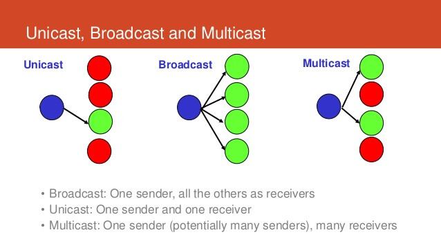
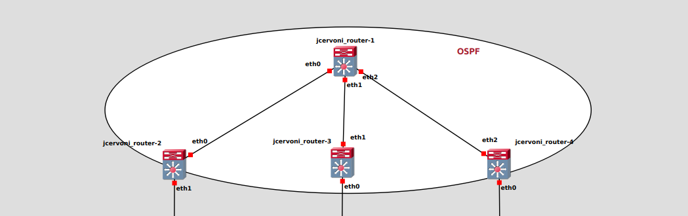

# Badass
The purpose of this project is to simulate a network and configure it using GNS3 with docker images.

## Documentation

[GNS3](https://docs.gns3.com/docs/)  
[FRRouting](https://frrouting.org/doc/)  
[RFC 7348](https://datatracker.ietf.org/doc/html/rfc7348)  

<details>
<summary>Overview</summary>

```bash
├── P1
│   ├── build_docker.sh
│   ├── P1.gns3project
│   ├── pjay_alpine_host
│   └── pjay_frr_router
├── P2
│   └── P2.gns3project
└── README.md
```
</details>

## How to run it
You need to have gns3 and docker installed.

Firstly build all the image by doing `./build_docker.sh` from P1. It will build the images we need for all the project.
Unzip the compressed files that start with the folder name.
Then open a project in gns3 and import gn3project as portable project.  

## Project
<details>
<summary>Part 1</summary>

In this part we shall deploy 2 machines: 1 router and 1 host.  
For the router we'll use an [FRRouting](https://frrouting.org/doc/) image and configure it by modifying the daemons file to ensure to enable those services:

+ BGPD daemon  
+ OSFPD daemon  
+ IS-IS daemon

Then, run the project. Open a terminal in the router, the command `ps a` should show those daemons running.  
</details>

<details>
<summary>Part 2</summary>

The second part is about configuring a [VXLAN](https://en.wikipedia.org/wiki/Virtual_Extensible_LAN) (Virtual eXtensible Local-Area Network).  
First deployment will allow static cast, while the second will use group for multicast.  

Difference between castings  



In static configuration each leaf know the address of other leaf(s). It is specified at the creation of the VXLAN (local and remote address).  
In dynamic multicast, leafs will broadcast ARP request to the members of the group to update its mac address table dynamically.  

</details>

<details>
<summary>Part 3</summary>

In the last part we have to setup a BGP EVPN network using OSPF. The point here is to configure the spine as route reflector for l2VPN EVPN address family.  
Doin that, we can separate Control plane from Data plane.  
OSPF will distributes routing information between routers so we don't need to broadcast anymore. It also updates topology changes and errors.  
Routers in the same area of the OSPF will be advertised of the area topology (Link-State Advertisement).  

Here an example of OSPF implementation, with one area containing the router reflector and the reflector clients:


</details>

<details>
<summary>Glossary</summary>

+ **OSFP**: **O**pen **S**hortest **P**ath **F**irst
+ **VXLAN**: **V**irtual e**X**tensible **L**ocal-**A**rea **N**etwork
+ **BGP**: **B**ordel **G**ate **P**rotocol
+ **EVPN**: **E**thernet VPN
+ **BUM**: **B**roadcast unknown **U**nicast **M**ulticast
</details>
